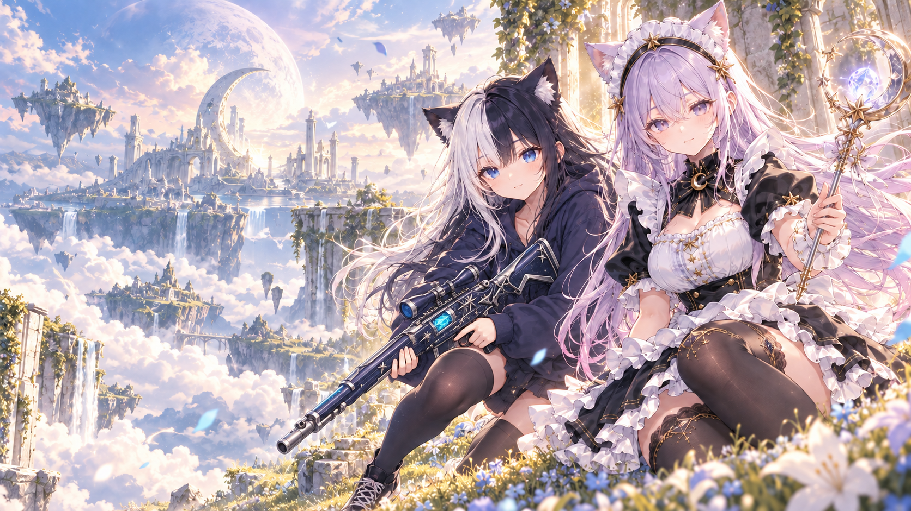

# ルナネコハンティング

にゃんるな・つきねこ・オムソロが冒険する、スマホとPC向けの3Dブラウザアクションゲームです。Three.jsで描画し、物語・キャラ育成・装備・編成をブラウザ内に保存します。

**[ブラウザで遊ぶ](https://lunaneco.github.io/lunaneko-hunting/)** — スマホ・PC対応、インストール不要。



## ゲーム内容

- 全2章・8幕・48WAVE。第1章で親友のつきねこと再会し、第2章「穂むすびの国」でオムソロを救出します。
- 最大2人の編成。魔法使いのにゃんるな、銃使いのつきねこ、光剣を使うオムソロを交代して操作します。各キャラに固有の必殺技があります。
- キャラ別の経験値・レベル、基礎HP・攻撃・防御、成長ツリー、アイテムを使う限界突破。
- クリスタルで選ぶ3択の祝福は、編成に応じて変わり、同じ幕の最後まで継続します。
- ステージミッション、付け替え可能なユニーク装備、通常／チャレンジモード。
- 異なる形のフィールド、2フロア、強敵のいる分岐。第2章は適正Lv.30で、専用の通常敵6種類とボス4種類が登場します。
- v1.18から撃破経験値を半減。既存の蓄積経験値・レベルを減らす変更はありません。

## 起動

Node.js 24推奨（最低22.12）。

```sh
npm ci
npm test
npm run build
npm run preview -- --port 4173
```

表示されたローカルURLを開いてください。Macでは `ゲームを起動.command` でも起動できます。`index.html` を直接開く方式ではありません。

```sh
# ソースを編集する場合
npm run dev

# 同じWi-Fiのスマホから確認する場合のみ、LANへ待受けを広げる
npm run preview:lan -- --port 4173
```

通常の起動はこのコンピューターからの接続に限定します。LAN確認にはOSのネットワーク許可が必要な場合があります。開発サーバーをインターネットへ直接公開しないでください。標準ビルドの `dist/` はサイトのルートパス向けです。

## 公開ページ

GitHub PagesでHTML・JavaScript・画像・3Dモデルを配信します。`main` への更新後、依存関係の監査・テスト・ビルドが成功すると自動で公開します。プルリクエストでは検証だけを実行し、公開用権限はデプロイのジョブに限定しています。

```sh
npm run build:pages
npm run audit:pages-build
npm run preview:pages -- --port 4176
```

Pages用の配布物は `dist-pages/`。画像・3Dモデル・PWA・オフラインキャッシュを `/lunaneko-hunting/` に対応させています。ローカル確認は `http://127.0.0.1:4176/lunaneko-hunting/` で行います。

## 操作

- スマホ：画面をドラッグして移動、画面右下のボタンで回避・必殺技・交代。
- PC：WASD／矢印キーで移動、Spaceで回避、Eで必殺技、Qで交代。
- 攻撃は近くの敵へ自動で行います。敵を倒し、光る門へ進むとステージが切り替わります。
- 最初の戦闘ではにゃんるなが操作を案内します。

## 保存と通信

アカウント登録、課金、外部API、広告・解析通信はありません。進行は、そのサイトを開いたブラウザのlocalStorageに保存します。保存先が異なるため、localhostと公開サイトでセーブデータは自動共有されません。公開サイトでは初回は新しい冒険として始まります。

HTTPSまたはlocalhostで初回の読み込みが完了すると、Service Workerがゲームファイルを保存し、以後はオフラインでも起動できます。セーブデータはクラウドへ送信しません。

## セキュリティと検証

v1.19で公開用のセキュリティ設定を追加しました。外部スクリプト・通信・プラグイン・フォーム送信を制限するCSP、localhostでの既定の待受け、開発サーバーの非公開ファイル保護を設定しています。配布版には開発用のゲーム状態操作機能を含めません。

[セキュリティ方針](SECURITY.md) · [公開前の監査記録](docs/SECURITY-AUDIT.md)

GitHub Actionsで依存関係の監査・テスト・ビルドを実行します。Dependabotを設定しています。ブラウザ監査の一部はローカルのChromeと開発／プレビューサーバーが必要です。

## 素材とライブラリ

ゲームのために用意したキャラクターモデル・イラスト・背景・装備画像と、コードで構築したフィールド・敵・エフェクトを使用しています。効果音と音楽はWeb Audioで生成します。外部CDNや外部フォントは使用しません。

Three.jsのMITライセンスを [THIRD_PARTY_NOTICES.txt](public/THIRD_PARTY_NOTICES.txt) に同梱しています。このライセンスはThree.jsに対するもので、ゲームの画像・キャラクター等へ一括で適用するものではありません。

公開リポジトリにはゲームのソース・実行用素材・テストを含めています。編集元のBlenderファイル、制作時の原本画像、動画、バックアップ、個人環境を含む制作ログは含めていません。
